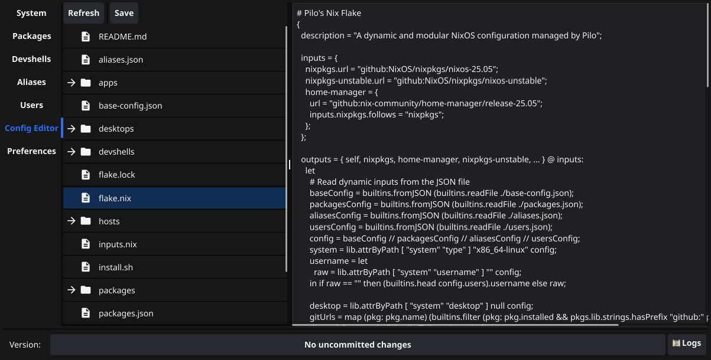

# Pilo

A tool for managing your Nix environment on Linux and macOS, with both a CLI and GUI.


*The Pilo GUI, launched with `pilo gui`.*

## Key Technologies

Pilo is built with a powerful set of tools to provide a robust and user-friendly experience:

-   **[Go](https://golang.org/)**: The core application logic is written in Go, providing a fast and reliable command-line interface.
-   **[Fyne](https://fyne.io/)**: The graphical user interface is built with the Fyne toolkit, offering a cross-platform experience.
-   **[Nix](https://nixos.org/)**: Pilo is designed to manage Nix environments, leveraging the power of declarative configurations and reproducible builds.
-   **[Cobra](https://cobra.dev/)**: The CLI is built with Cobra, a popular library for creating powerful and elegant command-line applications in Go.
-   **[Survey](https://github.com/AlecAivazis/survey)**: Interactive prompts are handled by Survey, making the CLI more user-friendly.

## ⚠️ Disclaimer

**This project is currently in active development and should not be considered stable.** Breaking changes may be introduced at any time. Always back up your system configuration before using Pilo, especially when making significant changes.

## Installation

Pilo offers two ways to manage your Nix environment. For a detailed explanation of the flake and its structure, see the [`flake/README.md`](flake/README.md).

### Full Installation (Pilo Binary + Flake)

This method installs the `pilo` binary, which includes an embedded `flake/` directory with version control. The Pilo application manages its own Nix configuration.

```bash
nix profile install github:stewlab/pilo
```

When you run `pilo` for the first time, it will create the necessary configuration files in `~/.config/pilo`, providing a managed Nix environment.

### Standalone Flake (Nix Configuration Only)

If you prefer to manage your Nix environment manually, you can use the `flake/` directory as a standalone Nix configuration. This approach is for users who are comfortable working directly with Nix commands.

To use the flake, build and apply it to your system using standard Nix commands:

-   **For NixOS**: `sudo nixos-rebuild switch --flake .#your-host`
    -   **Note**: You will need to replace `flake/hosts/nixos/hardware-configuration.nix` with the one from your system, typically located at `/etc/nixos/hardware-configuration.nix`.
-   **For Home Manager**: `home-manager switch --flake .#your-username`

This method gives you full control over the Nix configuration, allowing you to integrate it into your existing setup.

## Usage Examples

Here are a few examples of how you can use Pilo to manage your Nix environment.

### Scenario 1: Initial Setup on a New NixOS Machine

1.  **Install Pilo:**
    ```bash
    nix profile install github:stewlab/pilo
    ```
2.  **Run the Installer:**
    ```bash
    pilo setup
    ```
    Pilo will guide you through the initial setup, copying your hardware configuration and creating a new flake in `~/.config/pilo`.
3.  **Add a Package:**
    Open `~/.config/pilo/flake/packages.json` and add a new package to the list.
4.  **Rebuild Your System:**
    ```bash
    pilo rebuild
    ```
    Pilo will apply your changes and the new package will be available in your environment.

### Scenario 2: Managing Your Home Manager Configuration on macOS

1.  **Install Pilo:**
    ```bash
    nix profile install github:stewlab/pilo
    ```
2.  **Run the Installer:**
    ```bash
    pilo setup
    ```
3.  **Add a Package:**
    Open `~/.config/pilo/flake/packages.json` and add a new package to the list.
4.  **Rebuild Your Configuration:**
    ```bash
    pilo rebuild
    ```
    Pilo will run `home-manager switch` to apply your changes.

### Scenario 3: Restoring Your Configuration from a Git Repository

1.  **Install Pilo:**
    ```bash
    nix profile install github:stewlab/pilo
    ```
2.  **Restore from a Remote:**
    ```bash
    pilo setup --remote-url git@github.com:your-username/your-nix-config.git
    ```
    Pilo will clone your existing configuration and set it up on your new machine.
3.  **Rebuild Your System:**
    ```bash
    pilo rebuild
    ```

## Command Reference

Pilo provides several commands to manage your Nix environment.

### First-Time Setup

When you run `pilo` for the first time, it will automatically create the necessary configuration files in `~/.config/pilo`. You do not need to perform any manual setup.

### System & Configuration Management

-   `pilo setup`: Installs and configures the Pilo flake on your system.
    ```bash
    pilo setup --remote-url git@github.com:your-username/your-nix-config.git
    ```
-   `pilo rebuild`: Rebuilds your NixOS or Home Manager configuration after making changes.
    ```bash
    pilo rebuild
    ```
-   `pilo update [input]`: Updates all flake inputs, or just a single one.
    ```bash
    pilo update nixpkgs
    ```
-   `pilo rollback`: Rolls back your system to the previously working configuration.
    ```bash
    pilo rollback
    ```
-   `pilo gc`: Cleans up unused Nix store paths to free disk space.
    ```bash
    pilo gc
    ```
-   `pilo list [packages|generations]`: Lists all installed packages or previous system generations.
    ```bash
    pilo list packages
    pilo list generations
    ```
-   `pilo backup`: Creates a `.tar.gz` backup of your current Pilo configuration.
    ```bash
    pilo backup
    ```
-   `pilo restore`: Restores your configuration from a remote Git repository, overwriting local changes.
    ```bash
    pilo restore
    ```
-   `pilo config set-nix-path [path]`: Sets a custom path to the Nix binary if it's not in the standard location.
    ```bash
    pilo config set-nix-path /my/custom/nix/bin/nix
    ```

### Package Management

> **Note:** The primary, declarative way to manage packages is by adding them to the `packages.json` file in your `~/.config/pilo/flake` directory and running `pilo rebuild`. This ensures your package set is reproducible. The commands below are for temporary package installations or for managing packages outside of your core declarative configuration on non-NixOS systems.

-   `pilo install-pkg [pkg...]`: Installs one or more packages into your user profile (non-NixOS only).
    ```bash
    pilo install-pkg neovim ripgrep
    ```
-   `pilo remove [pkg...]`: Removes one or more packages from your user profile (non-NixOS only).
    ```bash
    pilo remove ripgrep
    ```
-   `pilo upgrade`: Upgrades all packages in your system configuration by updating the `flake.lock` file.
    ```bash
    pilo upgrade
    ```
-   `pilo search [query]`: Searches `nixpkgs` for a package.
    ```bash
    pilo search "visual studio code"
    ```
-   `pilo add-app [pname] [version] [url] [sha256]`: Adds a new application package from a URL to your flake.
    ```bash
    pilo add-app my-app 1.0.0 https://example.com/my-app.tar.gz <sha256-hash>
    ```

### Development Shells

-   `pilo shell [pkg...]`: Creates a temporary shell with the specified packages available.
    ```bash
    pilo shell go python3
    ```
-   `pilo develop [shell]`: Enters a persistent development shell defined in your flake (e.g., `go`, `python`).
    ```bash
    pilo develop go
    ```
-   `pilo devshell add [name]`: Adds a new dev shell configuration to your flake.
    ```bash
    pilo devshell add rust --packages rustc,cargo,clippy
    ```
-   `pilo devshell remove [name]`: Removes a dev shell configuration from your flake.
    ```bash
    pilo devshell remove rust
    ```
-   `pilo devshell enter [name]`: Enters a specific development shell.
    ```bash
    pilo devshell enter rust
    ```
-   `pilo devshell run [name] [command]`: Runs a command inside a specific dev shell without entering it.
    ```bash
    pilo devshell run rust "cargo build"
    ```

### User Management

-   `pilo users list`: Lists all users managed by your Pilo configuration.
    ```bash
    pilo users list
    ```
-   `pilo users add [username] [name] [email]`: Adds a new user to your Home Manager configuration.
    ```bash
    pilo users add jane "Jane Doe" "jane.doe@example.com"
    ```
-   `pilo users remove [username]`: Removes a user from your configuration.
    ```bash
    pilo users remove jane
    ```
-   `pilo users update [old_username] [new_username] [name] [email]`: Updates a user's details.
    ```bash
    pilo users update jane janedoe "Jane Doe" "jane.d@example.com"
    ```

### Alias Management

-   `pilo aliases add [name] [command]`: Adds a new shell alias to your configuration.
    ```bash
    pilo aliases add ll "ls -l"
    ```
-   `pilo aliases remove [name]`: Removes a shell alias.
    ```bash
    pilo aliases remove ll
    ```
-   `pilo aliases update [old_name] [new_name] [command]`: Updates an existing alias.
    ```bash
    pilo aliases update ll la "ls -la"
    ```
-   `pilo aliases duplicate [name] [command]`: Creates a copy of an alias with a new name.
    ```bash
    pilo aliases duplicate la lh "ls -lh"
    ```

### GUI

-   `pilo gui`: Launches the graphical user interface for Pilo.
    ```bash
    pilo gui
    ```

### Other Commands

-   `pilo completion [bash|zsh|fish|powershell]`: Generates the shell completion script for `pilo`.
    ```bash
    pilo completion zsh > ~/.zsh/completions/_pilo
    ```

### Configuration (`base-config.json`)

Pilo is configured through the `base-config.json` file, located in `~/.config/pilo/flake/`. This file allows you to customize your Nix environment. Below is a detailed breakdown of the available options.

-   **`commit_triggers`** (array of strings): A list of keywords that, when present in a commit message, will trigger a `pilo rebuild`.
-   **`packages`** (array of objects): A list of packages to be installed.
-   **`aliases`** (object): A map of custom shell aliases.
-   **`push_on_commit`** (boolean): If `true`, `pilo` will automatically push your configuration to the remote Git repository after each commit.
-   **`remote_url`** (string): The URL of the remote Git repository where your Pilo configuration is stored.
-   **`remote_branch`** (string): The default branch to use for the remote repository.
-   **`system`** (object): Contains system-specific settings:
    -   `username` (string): The primary username for the system.
    -   `desktop` (string): The desktop environment to use (e.g., `"gnome"`, `"plasma"`).
    -   `type` (string): The type of Nix installation (`"nixos"`, `"home-manager"`).
    -   `ollama` (object): Configuration for Ollama models.
-   **`users`** (array of objects): A list of users to be configured by Home Manager.

## File Structure

-   `flake/`: Contains the Nix flake and its related configurations. See the [flake/README.md](flake/README.md) for more details.
-   `cmd/`: Contains the main application code.
-   `internal/`: Contains internal packages and libraries used by the application.
-   `main.go`: The entry point for the application.
-   `go.mod` and `go.sum`: Go module files for managing dependencies.
-   `Containerfile`: A file for building the application container.
-   `container_build.sh`: A script for building and managing the application container.

## Development

First, clone the repository:

```bash
git clone https://github.com/stewlab/pilo.git
cd pilo
```

### Via Nix devShell

To build the `pilo` application using the included [Go](https://go.dev/) devShell, run the following command:

```bash
nix develop ./flake#go --command go build -o bin/pilo .
```

This command enters a Nix development shell that has Go installed, and then it builds the Pilo binary, placing it in the `bin` directory.

### Via Container

This is managed via the `container_build.sh` script, which automates building and running the application in a container.

> **Note:** Before running the script for the first time, you may need to make it executable:
> ```bash
> chmod +x container_build.sh
> ```

#### Building the Application Image

To build the final application image, run the following command from the project root:

```bash
./container_build.sh build
```

This command builds the image and tags it as `pilo-app`.

#### Running the Application

Once the image is built, you can run the application with:

```bash
./container_build.sh run pilo
```

Any arguments passed after `run` will be forwarded to the Pilo application inside the container. For example, to see the help message:

```bash
./container_build.sh run pilo --help
```

#### Development Workflow

The script also provides commands to streamline development:

-   `./container_build.sh start-dev`: Starts a persistent development container in the background.
-   `./container_build.sh shell-dev`: Opens an interactive shell inside the running development container.
-   `./container_build.sh run-dev`: Compiles and runs your application inside the development container.
-   `./container_build.sh stop-dev`: Stops and removes the development container.

#### Reusing the Containerfile for Other Go Applications

The `Containerfile` in this project is designed to be generic and can be used to build other Go applications with minimal changes.

To build a different Go application, you can pass the following arguments to the `podman build` or `docker build` command:

-   `APP_NAME`: The desired name for the final binary.
-   `MAIN_GO_PATH`: The path to the package containing the `main.go` file.
-   `LDFLAGS_STRING`: A string of linker flags, typically used for injecting version information.

Example command:

```bash
podman build \
  --build-arg APP_NAME="my-other-app" \
  --build-arg MAIN_GO_PATH="./cmd/my-other-app" \
  --build-arg LDFLAGS_STRING="-X main.Version=1.0.0" \
  -t my-other-app-image \
  -f Containerfile .

## Troubleshooting

If you encounter a situation where your system is unable to boot or you cannot log in after a configuration change, you can use the following recovery options at the GRUB boot menu:

1.  **Reboot** your computer.
2.  When the GRUB menu appears, press the **`e`** key to edit the boot entry.
3.  Find the line that starts with `linux` or `linuxefi`.
4.  Append one of the following options to the end of that line:
    *   `single` or `1`: This will boot you into **single-user mode**, which provides a root shell without starting most system services. This is useful for fixing critical system files or configurations.
    *   `rescue` or `emergency`: This will boot you into a more minimal **rescue shell**, mounting only the root filesystem as read-only. This is for more severe issues where even single-user mode is not accessible.

After adding the desired option, press **`Ctrl+X`** or **`F10`** to boot. From the recovery shell, you can attempt to manually fix your Nix configuration or use `pilo rollback` if the command is available in your path.