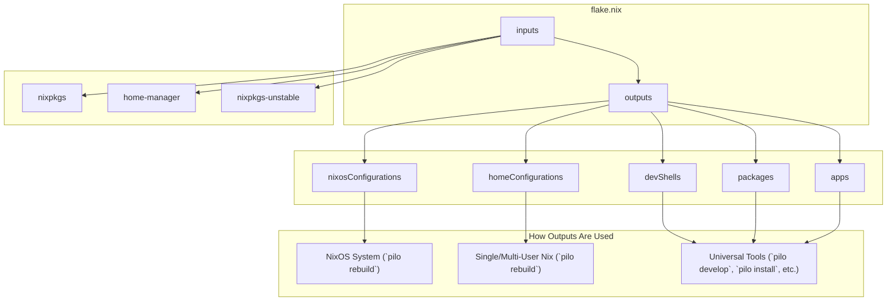

# Pilo Nix Configuration

This repository contains a self-contained and idiomatic, flake-based NixOS and Home Manager configuration.

## Overview

This configuration is built upon NixOS and Home Manager, managed via a single flake. It is designed to be a declarative and reproducible system configuration.

This flake-based configuration manages:
-   **NixOS System Configuration**: The core operating system settings, packages, and services for NixOS hosts.
-   **Home Manager**: User-specific configurations, including dotfiles and user packages.
-   **Development Shells**: Pre-configured development environments.
-   **Helper Apps**: A set of flake apps for common tasks like rebuilding the system.

## How It Works

This flake is designed to provide a unified configuration for three distinct Nix environments: a full NixOS system, a multi-user Nix installation on another Linux distribution, and a single-user Nix installation. It achieves this by exposing different outputs that are consumed by different tools.

-   **For NixOS**: The `nixosConfigurations` output defines the entire operating system. When you run `pilo rebuild`, it builds the complete system configuration from `./hosts/nixos/configuration.nix` and integrates Home Manager as a system module. This creates a fully declarative and reproducible OS.

-   **For Single-User & Multi-User Nix**: The `homeConfigurations` output is used for non-NixOS systems. It creates a standalone Home Manager configuration for each user defined in the flake. A user can run `pilo rebuild` to apply their personal configuration without affecting the base system or other users. This works identically for a single user on a machine or for multiple users who each manage their own environment from the same flake.

-   **Universal Tools**: The `devShells`, `packages`, and `apps` outputs are universal. They can be used on any Nix-enabled system (NixOS or otherwise) to create development environments (`pilo develop`), install custom packages (`pilo install`), or run applications (`nix run`).

### Configuration Flow Diagram

## `flake.nix` Explained

The `flake.nix` is the central point of the NixOS configuration. Here's a breakdown of its main parts:

*   **`description`**: A brief description of what this flake does.

*   **`inputs`**: This section declares the dependencies of your flake. These are other flakes that your configuration relies on.
    *   `nixpkgs`: The main Nix package repository for a specific NixOS version (25.05).
    *   `nixpkgs-unstable`: The unstable channel of nixpkgs, which gives you access to newer packages.
    *   `home-manager`: A tool to manage user-specific configurations (dotfiles, packages, etc.). It's configured to use the same `nixpkgs` as your main system.
    *   `pilo`: A local flake for the Pilo application itself.

*   **`outputs`**: This function is where the main logic of your flake resides. It takes the `inputs` as arguments and produces the outputs of the flake, such as your NixOS configuration, home-manager configurations, packages, and development shells.

*   **`let` block**: This is where local variables are defined for use within the `outputs` function.
    *   `config`: This is a crucial part of the setup. It reads the `base-config.json` file and parses it as JSON. This makes the Nix configuration dynamic, allowing you to change system settings by editing the JSON file instead of the Nix code.
    *   `system`, `username`, `desktop`: These variables are extracted from the `config` JSON object for convenience.
    *   `pkgs` & `unstablePkgs`: These instantiate the nixpkgs sets for both the stable and unstable channels, configured for your `system` architecture and allowing unfree packages.
    *   `lib`: A reference to the Nixpkgs library, which contains many useful functions.
    *   `specialArgs`: A set of arguments that will be passed down to your NixOS and home-manager modules. This is how you can pass things like `unstablePkgs` to other parts of your configuration.

*   **`outputs` attributes**: The `in` block that follows the `let` block defines the actual outputs of your flake.
    *   `homeConfigurations`: This builds the user-specific configurations using `home-manager`. It iterates over the users defined in `./users`.
    *   `apps`: Defines applications that can be run with `nix run`.
    *   `packages`: Defines packages that can be built with `nix build`.
    *   `devShells`: Defines development shells that can be entered with `nix develop`.
    *   `nixosConfigurations`: This is the main output. It defines your NixOS system configuration.
        *   It uses `lib.nixosSystem` to build a system configuration named `nixos`.
        *   It passes `specialArgs` down to the modules.
        *   It includes a list of `modules`, which are different Nix files that together define your system. This includes your main host configuration (`./hosts/nixos/default.nix`), your desktop environment configuration, and the `home-manager` module.
        *   It also configures `home-manager` to be used system-wide.

## Usage

This flake is managed by the `pilo` command-line tool. See the main [README.md](../README.md) for usage instructions.

## File Structure

-   `flake.nix`: The entry point for the flake. It defines the system configuration, Home Manager setup, and helper apps.
-   `hosts/nixos/`: Contains the main configuration files for the NixOS system.
-   `users/`: Contains user-specific configurations managed by Home Manager.
-   `devshells/`: Contains definitions for persistent development shells.